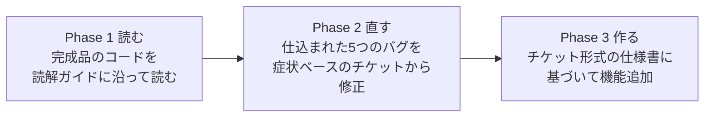

# 家計簿アプリで学ぶ Java実践読解教材

Javaの文法はひととおり学んだ。けれど「複数のクラスで構成された本物のアプリケーションのコード」は読んだことがない——この教材は、そんな学習者のための**「読んで・直して・作って学ぶ」教材**です。

シンプルな家計簿アプリ(Swing + H2 Database)を題材に、文法学習と実務のあいだにあるギャップを3つのPhaseで埋めていきます。

## 対象者

- Javaの文法(変数〜クラス、継承、インターフェース、コレクション、例外処理、ラムダの基礎)を学習済みの方
- 複数クラスにまたがる処理を追った経験や、実アプリを改修した経験がまだない方

## 学習の流れ



| Phase | 内容 | 使うブランチ | ガイド | 目安時間 |
|---|---|---|---|---|
| **Phase 1 読む** | 3層アーキテクチャの全体像をつかみ、処理の流れをトレースする | `main` | [docs/01_読解マップ.md](docs/01_読解マップ.md) | 4〜6時間 |
| **Phase 2 直す** | 実務風のバグチケット5件を、再現→仮説→検証→修正のサイクルで解決する | `exercise/bugs` | [docs/02_バグ修正演習.md](docs/02_バグ修正演習.md) | 6〜10時間 |
| **Phase 3 作る** | 受け入れ条件つきのチケット4件から選んで機能追加する | `main` から自分の作業ブランチ | [docs/03_機能追加演習.md](docs/03_機能追加演習.md) | 8時間〜 |

## 起動手順(必要なのはJDK 21だけ)

1. **JDK 21をインストール**します(詳しい手順は [docs/00_はじめに.md](docs/00_はじめに.md) を参照)。
2. このリポジトリをcloneします。

   ```bash
   git clone <このリポジトリのURL>
   cd kakeibo-tutorial
   ```

3. 起動します(ビルドツールのGradleは同梱されているのでインストール不要です)。

   ```bash
   ./gradlew run        # Windowsの場合: gradlew.bat run
   ```

初回起動時は、ライブラリのダウンロードとデータベースの作成(`./data/` フォルダに生成)が自動で行われます。カテゴリと3ヶ月分のサンプル取引が最初から入っています。

テストの実行は次のとおりです。

```bash
./gradlew test       # Windowsの場合: gradlew.bat test
```

## ドキュメント一覧

| ファイル | 内容 |
|---|---|
| [docs/00_はじめに.md](docs/00_はじめに.md) | 教材の目的、環境準備、最初の10分の過ごし方 |
| [docs/01_読解マップ.md](docs/01_読解マップ.md) | Phase 1: 全体地図・縦断トレース・責務ワークシート |
| [docs/02_バグ修正演習.md](docs/02_バグ修正演習.md) | Phase 2: バグチケット5件とデバッグ入門 |
| [docs/03_機能追加演習.md](docs/03_機能追加演習.md) | Phase 3: 機能追加チケット4件 |
| [docs/04_大量データ投入.md](docs/04_大量データ投入.md) | 性能検証用の5万件ダミーデータ投入手順 |
| docs/answers/ | 解説付き解答(**ネタバレ注意**) |

## 学習ポリシー

- **詰まったらAIに質問してかまいません。** 分からない文法・API・エラーメッセージは、AI(またはWeb検索)でどんどん調べてください。
- **ただし、`docs/answers/` を開く前に、必ず自分で仮説を立ててください。**「自分はこう考えた。答え合わせをしたらどうだったか」という往復こそが、この教材で一番力がつく部分です。
- Phase 2で `git diff main` を実行すれば答えが一目で分かってしまいますが、**それは最終手段**です。実務のバグにdiffは付いてきません。
