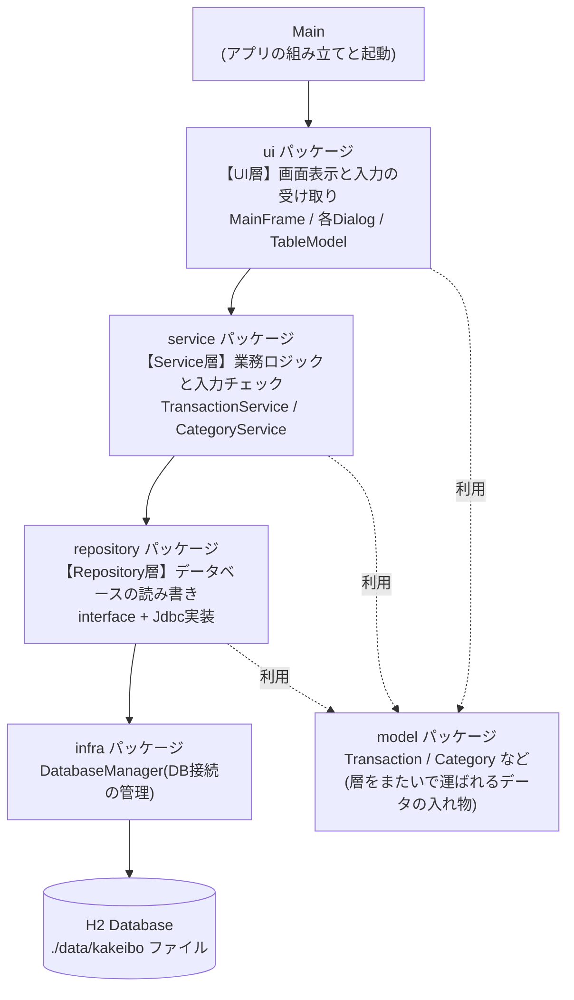

# 01. 読解マップ(Phase 1: 読む)

このドキュメントは、完成版(`main` ブランチ)のコードを読むためのガイドです。**記入欄を自分の言葉で埋めながら**進めてください。エディタでこのファイルを開いて直接書き込むか、紙に書き出してもかまいません。

所要時間の目安: 4〜6時間(一気にやらず、数回に分けるのがおすすめです)

---

## 1. 全体地図 — 3層アーキテクチャ

このアプリは**3層アーキテクチャ**という定番の構成でできています。処理を「画面」「業務ロジック」「データ保存」の3つの層(レイヤ)に分け、**上の層から下の層への一方向にだけ依存**させる構成です。



- 実線の矢印が「依存」です。**矢印は必ず上から下**に向かっています。ServiceがUIを呼ぶこと(下から上)は決してありません。
- `model` パッケージ(データの入れ物)と `exception` パッケージ(共通の例外)は、どの層からも使われる共通部品です。
- 一方向依存にしておくと、**下の層は上の層を知らずに済む**ため、部品の差し替えやテストがしやすくなります。この利点はテストコード(`src/test/java`)で実際に体感できます。

### パッケージ早見表

| パッケージ | 役割 | 主なクラス |
|---|---|---|
| (ルート) | アプリの組み立てと起動 | Main |
| `ui` | 画面。入力を受け取りServiceへ依頼、結果を表示 | MainFrame, TransactionDialog, CategoryDialog, SummaryDialog, TransactionTableModel |
| `service` | 業務ロジック。入力チェック(バリデーション)と業務ルール | TransactionService, CategoryService |
| `repository` | 永続化。SQLでデータベースを読み書き | TransactionRepository(+Jdbc実装), CategoryRepository(+Jdbc実装) |
| `model` | データの入れ物 | Transaction, Category, TransactionType, MonthlySummary, CategoryExpense |
| `infra` | 基盤。DB接続とスキーマ初期化 | DatabaseManager |
| `exception` | 共通の例外 | ValidationException, DataAccessException |

まず `Main.java` を開いて、この図のとおりに部品が組み立てられていることを確認してください(コンストラクタに部品を渡して組み立てる書き方を「コンストラクタインジェクション」と呼びます)。

---

## 2. 縦断トレース —「支出を1件登録する」を追いかける

ユースケース(利用シーン)をひとつ選び、**画面のボタンからデータベースまで**処理を貫いて追いかけます。これができると、他のどの機能も同じ要領で読めるようになります。

**進め方**: 各ステップのファイルを開き、指定されたメソッドを見つけて読み、「ここで何をしているか」を記入欄に**自分の言葉で1〜2行**書いてください。写経ではなく要約が目的です。

> 実際にアプリを起動して支出を1件登録し、その裏で何が起きたのかを想像してから始めると効果的です。

### ステップ0: 出発点を見つける

「登録」ボタンはどこで作られているでしょうか。`MainFrame.java` の `buildSouthPanel()` を開いてください。

```java
JButton registerButton = new JButton("登録");
registerButton.addActionListener(e -> onRegister());
```

`addActionListener` は「ボタンが押されたら、この処理を呼んでほしい」という**予約**です。ボタンを押した瞬間に呼ばれるのは `onRegister()` だと分かりました。ここから追跡開始です。

### トレース手順

| # | ファイル | 見るメソッド | 着目ポイント |
|---|---|---|---|
| 1 | `ui/MainFrame.java` | `onRegister()` | ダイアログを`new`するとき、第4引数に`null`を渡しています。この`null`は何を意味する?(ヒント: TransactionDialogのコンストラクタのJavadoc) |
| 2 | `ui/TransactionDialog.java` | コンストラクタ | `editing == null` のとき、日付欄に何が初期設定される? |
| 3 | `ui/TransactionDialog.java` | `buildLayout()` | 「保存」ボタンが押されたときに呼ばれるメソッドはどれ? |
| 4 | `ui/TransactionDialog.java` | `onSave()` | 例外の種類によって処理が分かれています。`ValidationException`と`DataAccessException`で、ユーザーへの見せ方はどう違う? |
| 5 | `ui/TransactionDialog.java` | `buildTransactionFromInput()`, `parseDate()`, `parseAmount()` | 画面の文字列が`LocalDate`や`int`に変換されます。「1,000」のようなカンマ付き入力はどこで処理される? |
| 6 | `service/TransactionService.java` | `register()` → `validate()` | どんな入力チェックが並んでいる? UI側でもチェックしているのに、なぜここでも行う?(`[設計意図]`コメントを読む) |
| 7 | `repository/JdbcTransactionRepository.java` | `insert()` | SQLの`?`(プレースホルダ)に値を詰めている流れを確認。`RETURN_GENERATED_KEYS`は何のため? |
| 8 | `ui/TransactionDialog.java` | `onSave()`(戻ってくる) | 保存に成功したら`saved`フィールドと`dispose()`で何が起こる? |
| 9 | `ui/MainFrame.java` | `onRegister()`(戻ってくる) | `dialog.isSaved()`がtrueのとき、何を呼び直している? |
| 10 | `ui/MainFrame.java` | `reloadTransactions()` | Serviceから取り直したデータを誰に渡している? |
| 11 | `ui/TransactionTableModel.java` | `setData()` | `fireTableDataChanged()`は誰への通知?これを呼ばないと画面はどうなると思う? |

### 記入欄

```
ステップ1(MainFrame.onRegister):


ステップ2(TransactionDialog コンストラクタ):


ステップ3(buildLayout → 保存ボタン):


ステップ4(onSave の例外処理):


ステップ5(入力文字列の変換):


ステップ6(TransactionService.register / validate):


ステップ7(JdbcTransactionRepository.insert):


ステップ8(保存成功後のダイアログ):


ステップ9(MainFrame に戻る):


ステップ10(reloadTransactions):


ステップ11(TransactionTableModel.setData):

```

### トレースの仕上げ — 理解度チェック

次の質問に答えられたら、このユースケースは読めています。

1. 金額欄に「abc」と入力して保存すると、**どのクラスのどのメソッドで**止まり、どんなメッセージが表示されますか。実際に試して、コードと突き合わせてください。
2. 金額欄に「-500」と入力すると、止めるのはUI層とService層のどちらですか。
3. 登録した直後、一覧に新しい行が出るのは「テーブルが自動で気づく」からではありません。誰が、何をきっかけに、何を呼んでいるからですか。

---

## 3. 責務ワークシート

全クラスについて「このクラスの責務(役割)を一言で」書いてください。**一言で言えないクラスは、まだ読めていないクラス**です。1行目は記入例です。

| クラス | パッケージ | 責務を一言で |
|---|---|---|
| Main | (ルート) | (記入例)部品を組み立ててアプリを起動する |
| MainFrame | ui | |
| TransactionTableModel | ui | |
| TransactionDialog | ui | |
| CategoryDialog | ui | |
| SummaryDialog | ui | |
| TransactionService | service | |
| CategoryService | service | |
| TransactionRepository(interface) | repository | |
| JdbcTransactionRepository | repository | |
| CategoryRepository(interface) | repository | |
| JdbcCategoryRepository | repository | |
| Transaction | model | |
| Category | model | |
| TransactionType | model | |
| MonthlySummary | model | |
| CategoryExpense | model | |
| DatabaseManager | infra | |
| ValidationException | exception | |
| DataAccessException | exception | |

---

## 4. 発展読解課題

トレースの型が身についたら、今度は自力で読みます。

### 課題A: 「編集」の流れをトレースせよ

「編集」ボタンから保存までを、セクション2と同じ形式で自分でトレースしてください(`MainFrame.onEdit()` が出発点です)。登録との違いに注目します。

- ダイアログに既存の値が入るのはどの処理?
- Service側では、登録(`register`)と更新(`update`)でチェック内容がひとつ増えています。何が増えている?なぜ?

### 課題B: 「削除」の流れをトレースせよ

`MainFrame.onDelete()` を読みます。

- 登録・編集と違って、削除には専用のダイアログクラスがありません。代わりに何を使っている?
- 「選択中の行」から「削除対象のID」をどうやって特定している?(`getSelectedTransaction()` を読む)

### 課題C: 月次集計のSQLを日本語で説明せよ

`JdbcTransactionRepository.summarizeMonth()` には2つのSQLがあります。それぞれを日本語で説明してください。

- 1つ目のSQL(`totalsSql`): `GROUP BY type` は何をしている?結果は最大何行になる?
- 2つ目のSQL(`categorySql`): `JOIN` は何のためにある?`ORDER BY total DESC` がないと画面はどうなる?
- おまけ: この集計をSQLではなくJavaのループで書いたら、どんな不利がありそうですか(Phase 2でこの答え合わせをすることになります)。

### 課題D: [設計意図] コメントをすべて探して読め

このリポジトリには、設計判断の理由を説明する `[設計意図]` コメントが**7箇所**埋め込まれています。すべて見つけて、それぞれ一言で要約してください。

```bash
grep -rn "設計意図" src/main    # IDEの全文検索(「設計意図」)でもOK
```

| # | 場所(クラス) | 要約 |
|---|---|---|
| 1 | | |
| 2 | | |
| 3 | | |
| 4 | | |
| 5 | | |
| 6 | | |
| 7 | | |

### 課題E(おまけ): テストコードを読め

`src/test/java` を眺めてください。

- `service` パッケージのテストには `InMemoryTransactionRepository` という「偽物のRepository」がいます。なぜこんなものが作れるのでしょうか。セクション1の「一方向依存の利点」と結びつけて説明してください。
- `repository` パッケージのテストは、本体と違って **in-memoryモード** のH2を使っています。テストクラス冒頭のコメントを読み、理由を確認してください。

---

## 次へ

全体地図・トレース・責務ワークシートが埋まったら、Phase 1は修了です。

→ [02_バグ修正演習.md](02_バグ修正演習.md)(Phase 2: 直す)
